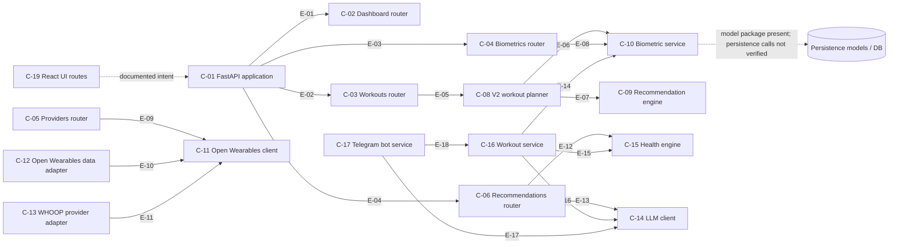
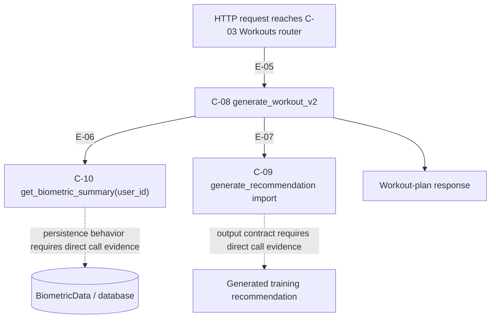
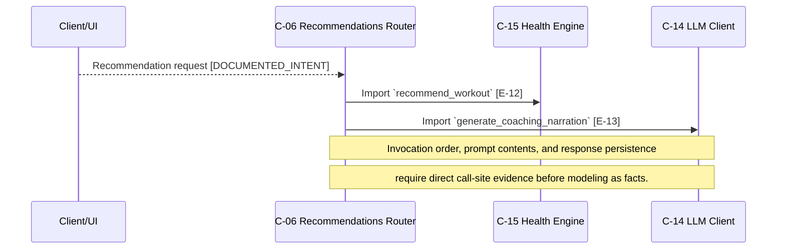
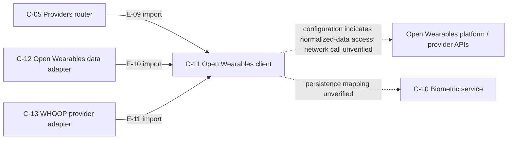

# Architecture Evidence Ledger

> **Purpose:** Versioned, source-grounded evidence for the architecture, workflow, sequence, and data-flow views of Open Wearables Trainer Agent.
>
> **Scope:** This ledger is pinned to a repository baseline. It distinguishes observed code facts from documented intent and prevents diagrams from silently becoming architecture fiction.

## Baseline

| Field | Value |
|---|---|
| Repository | `taylrd4ai/open_wearables_trainer_agent` |
| Baseline commit | `a6098af99925ea9206405ad1938490c7a575fbbe` |
| Baseline commit message | `fix: add python-telegram-bot to requirements` |
| Analyzed branch | `main` |
| Ledger branch | `docs/architecture-evidence-ledger` |
| Analysis date | 2026-09-29 |

## Evidence Standard

### Confidence labels

| Label | Meaning | Diagram treatment |
|---|---|---|
| `VERIFIED` | Direct code-search evidence shows a definition, import, registration, or call. | May be rendered as a solid edge. |
| `DOCUMENTED_INTENT` | Repository documentation states the behavior, but code execution/call evidence has not been independently verified. | May be rendered as a dashed edge labeled `intent`. |
| `INFERRED` | A relationship is suggested by module names or layout only. | Do not render as a production fact. Add only as a review item. |
| `GAP` | Earlier conceptual diagram claimed a relationship not proven at this baseline. | Omit from verified diagrams until evidence is added. |

### Required evidence fields

Every node or edge represented as `VERIFIED` must have:

1. A stable evidence ID.
2. Source file path.
3. Named symbol, import, route registration, or call site.
4. File blob SHA observed at the baseline.
5. Baseline commit SHA.
6. A short quote or deterministic description of the observed relationship.

A Git file blob SHA proves the version of a specific file. The baseline commit SHA proves the repository snapshot. Both are required for an auditable claim.

## Component Inventory

| ID | Component | Kind | Primary source | Blob SHA | Evidence | Status |
|---|---|---|---|---|---|---|
| C-01 | FastAPI application composition | Application entry point | `backend/app/main.py` | `44bbebca6e0df260fe7033aa447e290d3aeeb243` | `app.include_router(...)` registrations | VERIFIED |
| C-02 | Dashboard router | HTTP API router | `backend/app/api/v1/dashboard.py` | `cc87c22c203be03c9e7587d660f6e30057eacf28` | `router = APIRouter(tags=["dashboard"])` | VERIFIED |
| C-03 | Workouts router | HTTP API router | `backend/app/api/v1/workouts.py` | `b2d53f711384e89122cecbce5a6c19a68384c7b3` | `router = APIRouter(tags=["workouts"])` | VERIFIED |
| C-04 | Biometrics router | HTTP API router | `backend/app/api/v1/biometrics.py` | `8835a3363785292e5bf45a9872e09e70cb381f97` | `router = APIRouter(tags=["biometrics"])` | VERIFIED |
| C-05 | Providers router | HTTP API router | `backend/app/api/v1/providers.py` | `d738f634d7b35cae5fae49ff1c2ed240688c2703` | `router = APIRouter(prefix="/providers", tags=["providers"])` | VERIFIED |
| C-06 | Recommendations router | HTTP API router | `backend/app/api/v1/recommendations.py` | `202c16dfe84fd113d5a32cc8f8d5b9e8187967ee` | `router = APIRouter(prefix="/recommendations", tags=["recommendations"])` | VERIFIED |
| C-07 | Telegram router | HTTP API router | `backend/app/api/v1/telegram.py` | `573f7bf571e9ea6337e26fc419048e1634790545` | Module documentation identifies `telegram_router` registration/lifecycle expectation | DOCUMENTED_INTENT |
| C-08 | V2 workout planner | Application service | `backend/app/services/workout_planner_v2.py` | `cd185e054c72bbe7cb85d3991a35f21bbb8cafbd` | `async def generate_workout_v2(...)` | VERIFIED |
| C-09 | Recommendation engine | Application service | `backend/app/services/recommendation_engine.py` | `8d3b8136ccedfffaafd151290e4e8f0b02f9b4f7` | Imported as `generate_recommendation` by V2 planner | VERIFIED |
| C-10 | Biometric service | Application service | `backend/app/services/biometric_services.py` | `8baa45934cdf9644a19088e5b07cdcea6127dbda` | `async def get_biometric_summary(user_id: str)` | VERIFIED |
| C-11 | Open Wearables client | External-integration adapter | `backend/app/services/ow_client.py` | `f0f088d123f800fcc9cae667706e33a77f642a34` | module singleton `ow_client = OpenWearablesClient()` | VERIFIED |
| C-12 | Open Wearables data adapter | External-integration adapter | `backend/app/services/ow_data.py` | `4e991a46d13d5dc1b814f80fcbabf840fcfa3664` | imports `ow_client`; defines `fetch_workouts(...)` | VERIFIED |
| C-13 | WHOOP provider adapter | Provider adapter | `backend/app/services/providers/whoop.py` | `d7de78f3beb603f84188b222820b4304c9cd65a0` | `class WhoopProvider(BaseBiometricProvider)` imports `ow_client` | VERIFIED |
| C-14 | LLM client | External-integration adapter | `backend/app/services/llm_client.py` | `aeb7107c13cec88aacd9082c28a192f9b6fb2bb6` | Imported as `generate_coaching_narration` by API/service modules | VERIFIED |
| C-15 | Health engine | Training decision service | `backend/app/services/health_engine.py` | `c21203d0a962e8eeaeacb7bf6788f0af1b2d7fdf` | Imported as `recommend_workout` by recommendation/workout modules | VERIFIED |
| C-16 | Workout service | Application service | `backend/app/services/workout_service.py` | `533a1b09415e36292140b3f2a502c618fedd8565` | Imports biometrics, health engine, LLM client, and client profile | VERIFIED |
| C-17 | Telegram bot service | Messaging service | `backend/app/services/telegram_bot.py` | `96525e1d03bc8de5f2d3a6a19f2d96e1e89a228f` | Imports `llm_client` and `workout_service`; documentation says it shares FastAPI event loop | VERIFIED for imports; DOCUMENTED_INTENT for lifecycle |
| C-18 | Persistence model package | Data model package | `backend/app/models/` | package SHA varies by file | User, biometric, exercise, exercise entry, and workout session model modules present | DOCUMENTED_INTENT |
| C-19 | React application routes | Client/UI routing | `frontend/src/routes/` | directory-level composition | public root, authenticated layout, dashboard, recommendations, workouts, settings modules present | DOCUMENTED_INTENT |

## Verified Edge Ledger

| Edge ID | From | To | Relationship | Source evidence | Baseline commit | Status |
|---|---|---|---|---|---|---|
| E-01 | C-01 FastAPI app | C-02 Dashboard router | Router registration | `backend/app/main.py`: `app.include_router(dashboard_router, prefix="/api/v1")` | `a6098af99925ea9206405ad1938490c7a575fbbe` | VERIFIED |
| E-02 | C-01 FastAPI app | C-03 Workouts router | Router registration | `backend/app/main.py`: `app.include_router(workouts_router, prefix="/api/v1")` | `a6098af99925ea9206405ad1938490c7a575fbbe` | VERIFIED |
| E-03 | C-01 FastAPI app | C-04 Biometrics router | Router registration | `backend/app/main.py`: `app.include_router(biometrics_router, prefix="/api/v1")` | `a6098af99925ea9206405ad1938490c7a575fbbe` | VERIFIED |
| E-04 | C-01 FastAPI app | C-06 Recommendations router | Router registration | `backend/app/main.py`: `app.include_router(recommendations_router, prefix="/api/v1")` | `a6098af99925ea9206405ad1938490c7a575fbbe` | VERIFIED |
| E-05 | C-03 Workouts router | C-08 V2 workout planner | Import and awaited call | `backend/app/api/v1/workouts.py`: imports `generate_workout_v2`; executes `plan = await generate_workout_v2(...)` | `a6098af99925ea9206405ad1938490c7a575fbbe` | VERIFIED |
| E-06 | C-08 V2 workout planner | C-10 Biometric service | Import and awaited call | `backend/app/services/workout_planner_v2.py`: imports and awaits `get_biometric_summary(user_id)` | `a6098af99925ea9206405ad1938490c7a575fbbe` | VERIFIED |
| E-07 | C-08 V2 workout planner | C-09 Recommendation engine | Import | `backend/app/services/workout_planner_v2.py`: `from app.services.recommendation_engine import generate_recommendation` | `a6098af99925ea9206405ad1938490c7a575fbbe` | VERIFIED |
| E-08 | C-04 Biometrics router | C-10 Biometric service | Import and awaited call | `backend/app/api/v1/biometrics.py`: imports and returns `await get_biometric_summary(user_id)` | `a6098af99925ea9206405ad1938490c7a575fbbe` | VERIFIED |
| E-09 | C-05 Providers router | C-11 Open Wearables client | Import | `backend/app/api/v1/providers.py`: `from app.services.ow_client import ow_client` | `a6098af99925ea9206405ad1938490c7a575fbbe` | VERIFIED |
| E-10 | C-12 Open Wearables data adapter | C-11 Open Wearables client | Import | `backend/app/services/ow_data.py`: imports `ow_client` | `a6098af99925ea9206405ad1938490c7a575fbbe` | VERIFIED |
| E-11 | C-13 WHOOP provider adapter | C-11 Open Wearables client | Import | `backend/app/services/providers/whoop.py`: imports `ow_client` | `a6098af99925ea9206405ad1938490c7a575fbbe` | VERIFIED |
| E-12 | C-06 Recommendations router | C-15 Health engine | Import | `backend/app/api/v1/recommendations.py`: imports `recommend_workout` | `a6098af99925ea9206405ad1938490c7a575fbbe` | VERIFIED |
| E-13 | C-06 Recommendations router | C-14 LLM client | Import | `backend/app/api/v1/recommendations.py`: imports `generate_coaching_narration` | `a6098af99925ea9206405ad1938490c7a575fbbe` | `VERIFIED` |
| E-14 | C-16 Workout service | C-10 Biometric service | Import and awaited call | `backend/app/services/workout_service.py`: imports and awaits `get_biometric_summary(user_id)` | `a6098af99925ea9206405ad1938490c7a575fbbe` | VERIFIED |
| E-15 | C-16 Workout service | C-15 Health engine | Import | `backend/app/services/workout_service.py`: imports `recommend_workout` | `a6098af99925ea9206405ad1938490c7a575fbbe` | VERIFIED |
| E-16 | C-16 Workout service | C-14 LLM client | Import | `backend/app/services/workout_service.py`: imports `generate_coaching_narration` | `a6098af99925ea9206405ad1938490c7a575fbbe` | VERIFIED |
| E-17 | C-17 Telegram bot service | C-14 LLM client | Import | `backend/app/services/telegram_bot.py`: imports `llm_client` | `a6098af99925ea9206405ad1938490c7a575fbbe` | VERIFIED |
| E-18 | C-17 Telegram bot service | C-16 Workout service | Import | `backend/app/services/telegram_bot.py`: imports from `workout_service` | `a6098af99925ea9206405ad1938490c7a575fbbe` | VERIFIED |

## Architecture Diagram

Only `VERIFIED` relationships use solid arrows. Dashed arrows are explicitly non-verifiable at this baseline.

## Workout-Planning Workflow

**Workflow interpretation:** The API-to-planner and planner-to-biometric-service call paths are directly observed. The planner-to-recommendation-engine relationship is currently proven as an import but must be upgraded to a `VERIFIED` call edge by locating the exact invocation.

## Recommendation Sequence

## Wearable-Integration Data Flow

## Evidence Gaps and Backlog

| Gap ID | Claim not yet suitable as verified fact | What to capture | Target files |
|---|---|---|---|
| G-01 | Frontend route-to-API request paths | Fetch client function, route component, API endpoint, request method/path | `frontend/src/**`, `frontend/src/lib/**` |
| G-02 | Provider router-to-specific Open Wearables method calls | Endpoint function and invoked `ow_client` method | `backend/app/api/v1/providers.py`, `backend/app/services/ow_client.py` |
| G-03 | Open Wearables data persistence | Normalization object, persistence service/model write, transaction boundary | `ow_data.py`, `biometric_services.py`, model modules |
| G-04 | Recommendation router execution path | Exact `recommend_workout` and `generate_coaching_narration` call sites plus return schema | `recommendations.py`, `health_engine.py`, `llm_client.py` |
| G-05 | Recommendation-engine invocation in V2 planner | Exact `generate_recommendation(...)` invocation and argument mapping | `workout_planner_v2.py`, `recommendation_engine.py` |
| G-06 | Database relationships and writes | Model class names, foreign keys, repositories/session calls, migration IDs | `backend/app/models/**`, `database.py`, `migrations/**` |
| G-07 | Telegram application lifecycle | Actual `start_telegram`/`stop_telegram` imports/calls in FastAPI lifespan | `main.py`, `telegram.py`, `telegram_bot.py` |
| G-08 | External LLM network boundary | Provider client method, endpoint/model selection, timeout/retry/error controls | `llm_client.py`, `config.py` |

## Verification Procedure

For each architecture change:

1. Pin the ledger to the target commit SHA.
2. Update a component record when its defining file or blob SHA changes.
3. Add or update edge rows only when a named import, invocation, registration, or data write/read can be cited.
4. Mark an existing edge `GAP` rather than preserving it if its source evidence no longer exists.
5. Keep solid-arrow diagrams limited to `VERIFIED` evidence.
6. Use dashed arrows for `DOCUMENTED_INTENT`; never draw `INFERRED` dependencies as facts.
7. Add tests that exercise material high-risk paths and link their test files in the relevant component/edge record.

## Change-Control Checklist

- [ ] Baseline commit SHA updated.
- [ ] Modified files have refreshed blob SHAs.
- [ ] Every solid diagram edge has an Edge ID.
- [ ] Every Edge ID maps to source evidence and a status.
- [ ] New external data movement identifies the source, data class, destination, and control owner.
- [ ] LLM calls document model/provider selection, input fields, output validation, and fallback behavior.
- [ ] Sensitive biometric-data reads/writes link to authorization, logging, retention, and deletion controls.
- [ ] New or changed architecture edges have a corresponding test or a tracked gap.
